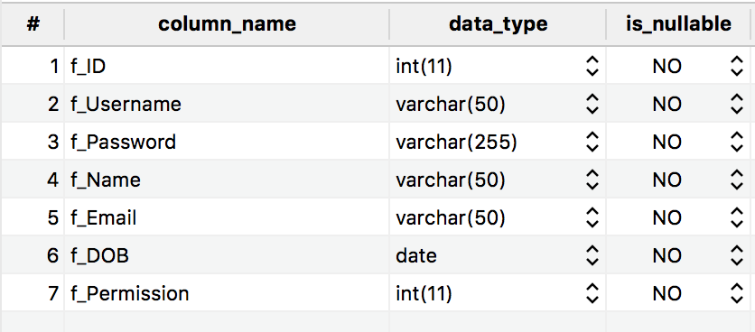

<!-- .slide: class="center" -->

# Kiểm tra giữa kỳ

---

- Xây dựng chức năng đăng ký tài khoản người dùng
  - Có kiểm tra dữ liệu nhập ở client-side
  - Mật khẩu được mã hoá bằng thuật toán `md5`
  - Dữ liệu người dùng lưu vào table `users`
  - Cho trước project Express MVC đã khai báo sử dụng view-engine express-handlebars

---

### register.html

```html
<form id="registerForm" novalidate method="POST">
  <input type="text" id="username" name="username">
  <input type="password" name="password">
  <input type="password" name="confirm">
  <input type="text" name="fullName">
  <input type="email" name="email">
  <input type="text" name="dob">
  <button type="submit">Register</button>
</form>
```

---

### app.js

```js
var express = require('express');
var app = express();
app.use(express.json());
app.use(express.urlencoded({ extended: true }));

require('./middlewares/view-engine')(app);

app.get('/', (req, res) => {
  res.render('home');
})

require('./middlewares/error-handlers')(app);
app.listen(process.env.PORT || 3000);
```

---

### mysql: table `users`



---

### utils/db.js

```js
exports.add = (tableName, entity) => {
  return new Promise((resolve, reject) => {
    var connection = createConnection();
    var sql = `insert into ${tableName} set ?`;
    connection.connect();
    connection.query(sql, entity, (error, results) => {
      if (error) {
        reject(error);
      } else {
        resolve(results.insertId);
      }
      connection.end();
    });
  });
}
```