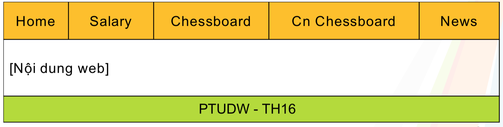
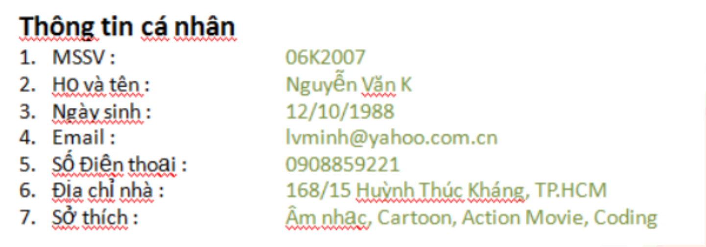
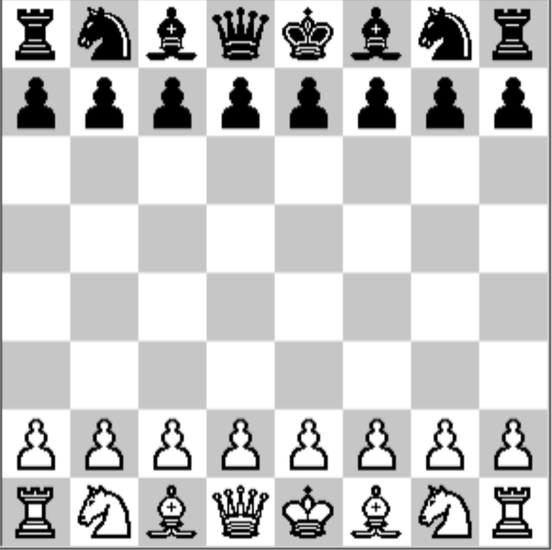

# Thiết kế HTML

---

Các file **html** đều chứa các thông tin sau
- Title: [Tên Nhóm] - PTUDW - D03
- Bố cục

- Có liên kết đến các file **html** cụ thể

---

### index.html

---

### chessboard.html

(ảnh các quân cờ được lưu trong thư mục **imgs**)

 <!-- .element: style="width: 50%" -->

---

## Bài tập về nhà

1. BTCN: Xây dựng site FAQ
  + Tham khảo [torviet FAQ](http://torviet.com/faq.php)
2. Xem trước slide **CSS**