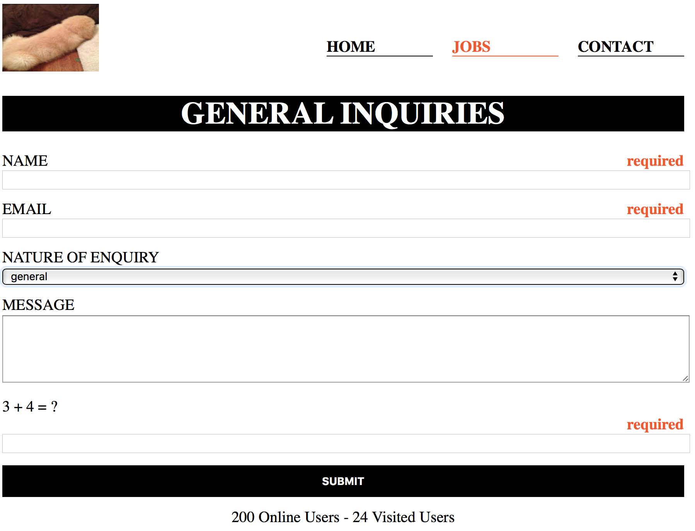

# CSS

---

## Link


---

## Navigation bar

Background: **imgs/navbg.gif,** size: 3x19

```html
<div id="nav-menu">
  <ul>
    <li><a href="#">Services</a></li>
    <li><a href="#">About us</a></li>
    <li><a href="#">Contact us</a></li>
  </ul>
</div>
```

---

<!-- .slide: data-background-image="2-nav.gif" -->

---

### contact.html

 <!-- .element: style="width: 75%" -->