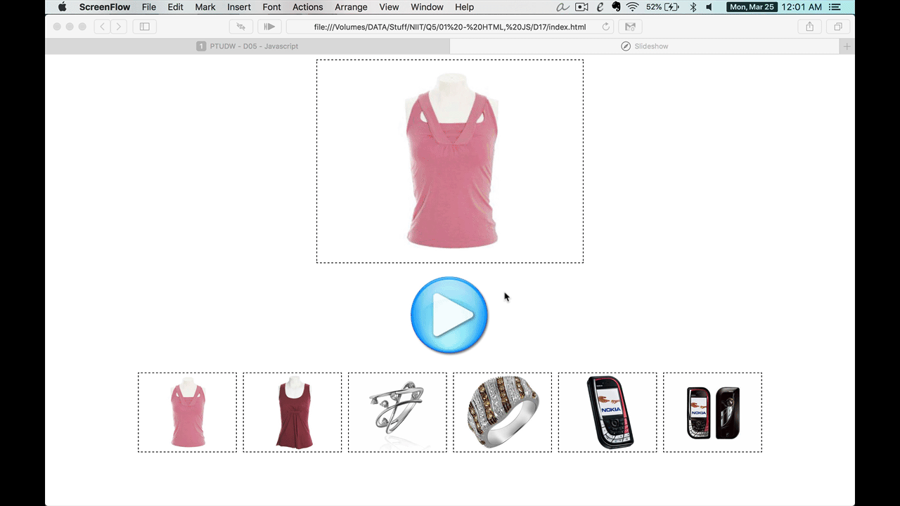

# Javascript

---

## Basic

- `<style>` nên chèn ở `<head>` hay chèn ở `<body>`? Tại sao?
- `<script>` nên chèn ở `<head>` hay chèn ở `<body>`? Tại sao? 

---

## Basic

- Cho biết lệnh tạo đối tượng `character` gồm các thông tin
  - name -> ryu
  - age -> 25
  - hp -> 1000
  - skills -> array: hadoken, shoryuken, tasumaki

---

## EX. 1

Viết `html`, `js` xây dựng giao diện web cho phép chọn ngày, tháng, năm sinh.
- Sử dụng `<select>` cho từng thành phần (ngày/tháng/năm)
  - Ngày: 1-31
  - Tháng: 1-12
  - Năm: 1980-2019

---

## EX. 2

```html
<form name="frmMain">
  X = <input type="text" id="txtX" name="txtX"><br/>
  Y = <input type="text" id="txtY" name="txtY"><br/>
  S = <input type="text" id="txtS" name="txtS" readonly><br/>
  <button type="button">SUM</button>
</form>
```

- Xây dựng hàm tính `SUM S = X + Y`
  - Kết quả được thể hiện ở ô `txtS`
  - Nếu user không nhập X hoặc Y, hoặc dữ liệu trong ô X, Y không phải là số thì thông báo lỗi.
- Focus vào ô `txtX` khi web load.

---

## EX. 3

```html
<div id="divR"></div>
<form name="f">
  <textarea name="txtContent"></textarea>
  <button type="button">display BOLD</button>
</form>
```

- Xây dựng hàm `displayBold()`, làm đậm dữ liệu trong ô `#txtContent` và thể hiện ở `#divR`

---

## EX. 4

```html
<div id="main">
  Lorem ipsum dolor sit amet, consectetur adipisicing elit. Dolorem, deleniti? Quos, aperiam ipsam. A expedita placeat iste dicta quis, rem, consequatur veritatis, aliquam voluptas amet porro quidem exercitationem facilis aperiam.
</div>
<button type="button">change color</button>
```

- Xây dựng lệnh `changeColor()`, cho phép đổi màu nội dung trong `#main`
  - Màu được random từ danh sách màu `['red', 'blue', 'purple']`

---

## EX. 5

```html
<div id="counter"></div>
<button type="button">START</button>
<button type="button">STOP</button>
```

- Xây dựng bộ đếm số, bắt đầu từ 1, tăng 1 đơn vị sau mỗi giây.
  - `START` bắt đầu tăng
  - `STOP` ngừng & `RESET` giá trị bộ đếm về 1

---

## Bài tập về nhà

<!--  -->
