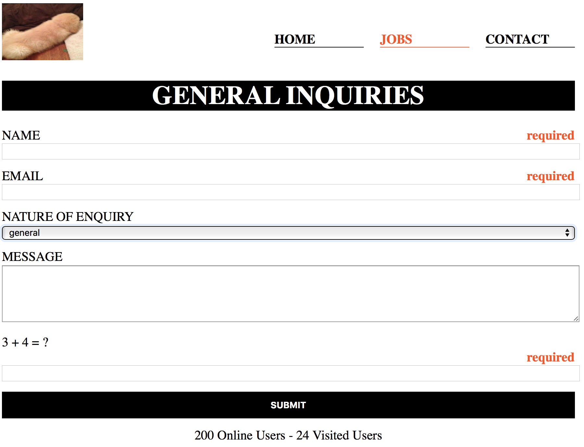
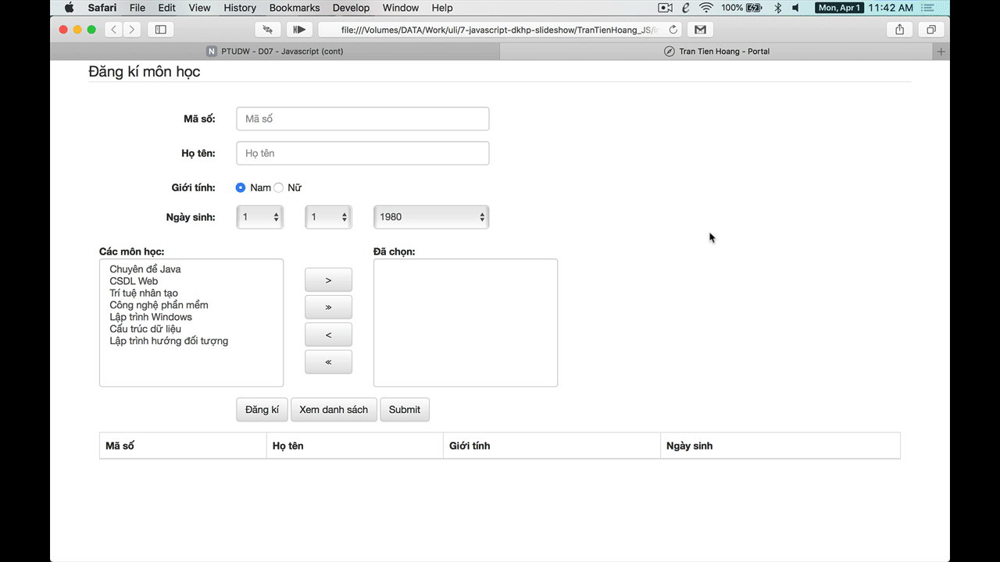

<!-- .slide: class="center" -->

# Javascript (cont)

---

### contact.html

 <!-- .element: style="width: 70%" -->

---

```html
<form method="post" name="frmMain">
  <input type="text" name="txtName">
  <input type="text" name="txtEmail">
  <textarea rows="5" name="txtMessage"></textarea>
  <div class="form-group">
    <div id="captcha"></div>
    <input type="text" name="txtCaptcha">
  </div>
  <div class="form-group">
    <button type="submit" name="btnSubmit">
      Submit
    </button>
  </div>
</form>
```

- Làm thế nào để ngăn chặn form submit?
  - User submit bằng cách nhấn `btnSubmit` hoặc `Enter` ở ô nhập liệu.

---

- Xây dựng hàm `validate()`, kiểm tra dữ liệu nhập của form `frmMain`
  - Các ô nhập liệu đều có giá trị
  - Email phải đúng định dạng (có chứa `@` và có domain ở phía sau `@`)

---

- Phát sinh catpcha (1 phép toán cộng ngẫu nhiên, vd `3 + 4 = ?`) khi page_loaded
- Điều chỉnh hàm `validate()`, kiểm tra xem captcha user nhập có chính xác không?

---

## Bài tập về nhà

Làm `dkhp.html` (xem slide kế)

---

### dkhp.html

 <!-- .element: style="width: 90%" -->