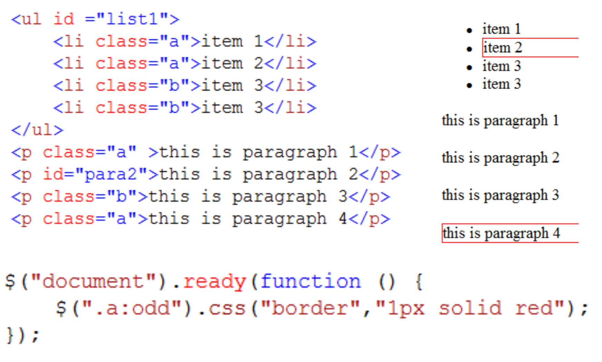

<!-- .slide: class="center" -->

# jQuery

---

## Giới thiệu jQuery

- Thư viện `javascript` mã nguồn mở, miễn phí
- Tạo các trang web có khả năng tương tác cao và tương thích trên nhiều trình duyệt.

>>>

## Lợi ích

- Truy xuất các thành phần nội dung trang web với cú pháp tương tự `css` (thông qua các bộ chọn `selector`)
- Hỗ trợ nhiều thao tác xử lý trên tập các `element` chỉ bằng một dòng lệnh (statement chaining)
```js
$('selector').func1().func2().func3()...;
```
- Đơn giản hóa cách viết mã nguồn javascript (***write less, do more***)
- Tách biệt mã xử lý `javascript` và thành phần thể hiện `HTML`

>>>

## Cài đặt

- Download: https://jquery.com/download/
- Version mới nhất: 3.3.1
- Có 2 version:
  - [Production](https://code.jquery.com/jquery-3.3.1.min.js "jQuery production version") (triển khai lên host thật)
  - [Development](https://code.jquery.com/jquery-3.3.1.js "jQuery development version") (dùng trong quá trình phát triển, hỗ trợ debug, ...)

>>>

## Ví dụ sự kiện `onload`

```html
<!-- javascript -->
<script>
  function onloadHandler() {
    alert('run after all page contents have been downloaded, including image');
  }

  window.onload = onloadHandler;
</script>
```

```html
<!-- jQuery -->
<script src="https://code.jquery.com/jquery-3.3.1.min.js"></script>
<script>
  $(function() {
    alert('document ready!');
  })
</script>
```
>>>

### Các thành phần trong `jQuery`

- `Core functionality`: các phương thức core của JQuery và các hàm tiện ích được sử dụng thường xuyên.
- `Selector` & `Traveral`: chọn, tìm kiếm element, duyệt qua các element trong document.
- `Manipulation` & `CSS`: thay đổi nội dung các element trong document, làm việc với css.

>>>

### Các thành phần trong `jQuery`

- `Event`: đơn giản hóa việc xử lý event. Cung cấp event helper function đăng ký nhanh các event.
- `Effect` & `Animation`: cung cấp các hàm hỗ trợ tạo animation & effect.
- `Ajax`: cung cấp các hàm hỗ trợ Ajax
- `Extensibility`: hỗ trợ tạo plugin bổ sung thêm các chức năng mới vào core library.
- **Cùng rất nhiều thư viện UI dựa trên jQuery**

---

## jQuery Selector

- Truy xuất nội dung (`element`) trong document dựa trên biểu thức selector cung cấp.
  - `Selector` sử dụng cú pháp tương tự CSS.

- Tập kết quả do `Selector` và `Filter` trả về: `JQuery objects` (không phải `DOM objects`).

>>>

| Selector      | Ý nghĩa                                                                                               |
| ------------- | ----------------------------------------------------------------------------------------------------- |
| tag           | Chọn tất cả các element có tên là `tag`                                                        |
| \#id          | Chọn tất cả các element có ID là `id`                                                           |
| .className    | Chọn tất cả các element với thuộc tính class có giá trị là `className`                     |
| tag.className | Chọn tất cả các element thuộc loại `tag`, với thuộc tính class có giá trị là `className` |
| \*            | Chọn tất cả các element trên document.                                                           |

>>>

| Selector                 | Ý nghĩa                                                                                        |
| ------------------------ | ---------------------------------------------------------------------------------------------- |
| Selector1, .., selectorN | Chọn tất cả các element được xác định bởi tất cả các `selector`                      |
| .class1,.class2          | Chọn tất cả các element có khai báo `class1` hoặc `class2`                              |
| Parent > Child           | Chọn tất cả các `Child` element là con trực tiếp của `Parent`                          |
| Ancestor Descendant      | Chọn tất cả các Descendant element là con cháu của Ancestor (chứa bên trong Ancestor) |
| Prev + Next              | Chọn tất cả các `Next` element nằm kế tiếp `Prev` element                               |
| Prev ~ Siblings          | Chọn tất cả các element anh em khai báo sau `Prev` và thỏa `Sibling` selector           |

>>>

| Selector  | Ý nghĩa                                            |
| --------- | -------------------------------------------------- |
| :input    | Chọn tất cả thẻ `input`, `textarea` trên Form |
| :text     | Chọn tất cả `text` field trên Form             |
| :password | Chọn tất cả `password` field                    |
| :radio    | Chọn tất cả `radio` button                      |
| :checkbox | Chọn tất cả `checkbox`                          |
| :submit   | Chọn tất cả button `submit`                     |
| :reset    | Chọn tất cả button `reset`                      |
| :image    | Chọn tất cả `image`                             |
| :button   | Chọn tất cả `button`                            |
| :file     | Chọn tất cả control `upload` file               |

>>>

```html
<p class="a">Paragraph 1</p>
<p id="para2">Paragraph 2</p>
<p class="b">Paragraph 3</p>
<p>Paragraph 4</p>

<script>
  // bổ sung viền đỏ cho tất cả thẻ p
  $('p').css('border', '1px solid red');

  // bổ sung viền đỏ cho #para2
  $('#para2').css('border', '1px solid red');
</script>
```
```html
<ul>
  <li class="a">Item 1</li>
  <li class="a">Item 2</li>
  <li class="b">Item 3</li>
</ul>

<script>
  // bổ sung viền đỏ cho li class "a"
  $('li.a').css('border', '1px solid red');
</script>
```

---

## jQuery Filter

- jQuery `Selector` trả về 1 tập đối tượng
- jQuery `Filter` được dùng để lọc trên kết quả chọn của jQuery `Selector`.

>>>

### jQuery Filter
- Có 6 loại filter:
  - `Basic`: lọc phần tử ở vị trí đầu tiên, cuối cùng, chẵn, lẻ, ...
  - `Content`: lọc dựa trên nội dung
  - `Visibility`: lọc dựa trên trạng thái hiển thị của element
  - `Attribute`: lọc dựa trên thuộc tính của element
  - `Child`: lọc dựa trên mối QH với element cha
  - `Form`: lọc trên các thành phần khai báo trên Form

>>>

| Filter          | Ý nghĩa                                                               |
| --------------- | --------------------------------------------------------------------- |
| :first          | Chọn phần tử đầu tiên trong tập kết quả do Selector trả về  |
| :last           | Chọn phần tử cuối cùng trong tập kết quả do Selector trả về |
| :even           | Chọn phần tử chẵn                                                 |
| :odd            | Chọn phần tử lẻ                                                   |
| :eq (index)     | Chọn phần tử tại vị trí index                                   |
| :gt (index)     | Chọn phần tử có vị trí > index                                  |
| :lt (index)     | Chọn phần tử có vị trí < index                                  |
| :header         | Chọn tất cả header element (H1, H2, .. H6)                         |
| :not (selector) | Chọn phần tử không thỏa selector                                 |

>>>


>>>



>>>


>>>

| Filter                                       | Ý nghĩa                                                               |
| -------------------------------------------- | --------------------------------------------------------------------- |
| \[attribute\]                                | Lọc các phần tử có khai báo attribute                           |
| \[attribute=value\]                          | Lọc các phần tử có attribute với giá trị = value              |
| \[attribute!=value\]                         | Lọc các phần tử có attribute với giá trị != value             |
| \[attribute^=value\]                         | Lọc các phần tử có attribute với giá trị bắt đầu là value  |
| \[attribute$=value\]                         | Lọc các phần tử có attribute với giá trị kết thúc là value |
| \[attribute*=value\]                         | Lọc các phần tử có attribute chứa giá trị value               |
| \[attributeFilter1\] \[attributeFilter2\]... | Lọc các phần tử thỏa tất cả các attribute filter.             |

>>>


>>>

| Filter          | Ý nghĩa                                                                  |
| --------------- | ------------------------------------------------------------------------ |
| :contains(text) | Lọc các phần tử có chứa chuỗi text                                |
| :empty          | Lọc các phần tử rỗng                                                |
| :has(selector)  | Lọc các phần tử có chứa ít nhất 1 element thỏa selector         |
| :parent         | Lọc các phần tử là cha (chứa ít nhất 1 element khác hoặc text) |

>>>


>>>


>>>

<!-- .slide: class="lw3" -->
| Filter               | Ý nghĩa                                                                                       |
| -------------------- | --------------------------------------------------------------------------------------------- |
| :nth-child(index)    | Lọc các phần tử theo vị trí so với cha của nó                                        |
| :nth-child(even)     | Lọc các phần tử theo vị trí so với cha của nó                                        |
| :nth-child(odd)      | Lọc các phần tử theo vị trí so với cha của nó                                        |
| :nth-child(equation) | Lọc phần tử theo vị trí ( vị trí thỏa phương trình tham số ) so với cha của nó |
| :first-child         | Lấy phần tử đầu tiên so với cha của nó                                                |
| :last-child          | Lấy phần tử cuối cùng so với cha của nó                                               |
| :only-child          | Lấy phần tử nếu phần tử này là con duy nhất so với cha của nó                     |

>>>


---

<!-- .slide: class="center" -->
# DOM Manipulation

>>>

### Duyệt nội dung document

| Hàm              | Ý nghĩa                                                                             |
| ---------------- | ----------------------------------------------------------------------------------- |
| size(), length   | Lấy số phần tử trong tập kết quả của Selector                               |
| get()            | Lấy tập DOM elements trong tập kết quả của Selector                           |
| get(index)       | Lấy DOM element ở vị trí index                                                  |
| find(expression) | Lấy các element con cháu thỏa expression                                        |
| each()           | Gọi thực thi phương thức với từng element trong tập kết quả của Selector |

>>>

```html
<p class="a">Paragraph 1</p>
<p id="para2">Paragraph 2</p>
<p class="b">Paragraph 3</p>
<p>Paragraph 4</p>

<script>
  console.log($('p').size()); // 4

  for (var i = 0; i < $('p').size(); ++i) {
    var name = $('p').get(i); // DOM element
    var innerHTML = $('p').get(i).innerHTML;
  }
</script>
```
```html
<script>
  $('ul').find('li.a').css('border','1px solid red');

  var i = 1;
  $('p').each(function () {
    $(this).html('Custom paragraph ' + i);
    i++;
  });
</script>
```
>>>

### Tạo nội dung mới

- Phương thức `$('html content')`, kết quả trả về là 1 JQuery object.

```js
var h1 = $('<h1>heading 1</h1>'); // tạo thẻ h1
$('p:eq(0)').html(h1);
```
>>>

### Truy cập, thay đổi nội dung `element`

| Hàm                  | Ý nghĩa                                                                                             |
| -------------------- | --------------------------------------------------------------------------------------------------- |
| html()               | Lấy nội dung html bên trong element đầu tiên thỏa selector                                    |
| html(newContent)     | Thay đổi nội dung html bên trong mọi element thỏa selector ( tương tự innerHTML trong DOM ) |
| text()               | Lấy nội dung text bên trong element đầu tiên                                                   |
| text(newTextContent) | Thay đổi nội dung text bên trong mọi element thỏa selector ( tương tự innerText )           |

>>>

### Thay đổi thuộc tính `attribute`

| Hàm                 | Ý nghĩa                                                                                                  |
| ------------------- | -------------------------------------------------------------------------------------------------------- |
| attr(name)          | Lấy attribute value của element đầu tiên thỏa selector                                              |
| attr(properties)    | Thiết lập tập attribute cho mọi element thỏa selector. Properties có dạng object-notation syntax. |
| attr(key, value)    | Thiết lập attribute cho mọi element thỏa selector                                                    |
| attr(key, function) | Thiết lập giá trị attribute dựa trên 1 function với mọi element thỏa selector.                  |
| removeAttr(name)    | Xóa attribute với mọi element                                                                         |

>>>

```html
<a href="trang1.html">Trang 1</a>

<script>
  $('a').attr('href', 'trang2.html');
  $('a').text('trang 2');
</script>
```

```html
<a href="book1.jpg">
  
</a>

<script>
  $('a').attr('target', '_blank');
  $('a img').attr('src', 'book2.jpg');
  $('a').removeAttr('href');
  $('img').attr({
    src: 'book2.jpg',
    alt: 'hello world'
  });
</script>
```

>>>

### Chèn nội dung vào element

| Hàm                 | Ý nghĩa                                                                                                |
| ------------------- | ------------------------------------------------------------------------------------------------------ |
| append(content)     | Chèn content vào sau nội dung có sẵn của các element thỏa selector                             |
| appendTo(selector)  | Chèn element thỏa selector vào sau nội dung có sẵn của các element thỏa selector tham số     |
| prepend(content)    | Chèn content vào trước nội dung có sẵn của các element thỏa selector                         |
| prependTo(selector) | Chèn element thỏa selector vào trước nội dung có sẵn của các element thỏa selector tham số |
| after(content)      | Chèn content vào sau các element thỏa selector                                                     |
| before (content)    | Chèn content vào trước các element thỏa selector                                                 |

>>>


>>>

### Thao tác với CSS
<!-- .slide: class="lw3 smallTable" -->
| Hàm                  | Ý nghĩa                                                                                                                           |
| -------------------- | --------------------------------------------------------------------------------------------------------------------------------- |
| css(name)            | Lấy giá trị thuộc tính name của element đầu tiên thỏa selector                                                           |
| css(properties)      | Thiết lập tập thuộc tính css đối với mọi element thỏa selector                                                           |
| css(property, value) | Thiết lập giá trị 1 thuộc tính đối với mọi element thỏa selector                                                        |
| addClass(class)      | Thêm class vào các element thỏa selector                                                                                      |
| hasClass(class)      | Kiểm tra class có tồn tại trong các element thỏa selector                                                                   |
| removeClass(class)   | Xóa class khỏi các element thỏa selector                                                                                      |
| toggleClass(class)   | Thêm class vào các element thỏa selector nếu class chưa khai báo, ngược lại nếu đã tồn tại rồi, class sẽ bị xóa |

>>>

### Thay đổi vị trí element

| Hàm               | Ý nghĩa                                                                                |
| ----------------- | -------------------------------------------------------------------------------------- |
| offset()          | Lấy vị trí của element đầu tiên thỏa selector so với document                  |
| position()        | Lấy vị trí của element đầu tiên thỏa selector so với vị trí của element cha |
| scrollTop()       | Lấy vị trí scroll top của element đầu tiên thỏa selector                        |
| scrollLeft()      | Lấy vị trí scroll left của element đầu tiên thỏa selector                       |
| scrollTop(value)  | Thiết lập vị trí scroll top của mọi element thỏa selector                       |
| scrollLeft(value) | Thiết lập vị trí scroll left của mọi element thỏa selector                      |

>>>

### Thay đổi kích thước

| Hàm         | Ý nghĩa                                                   |
| ----------- | --------------------------------------------------------- |
| height()    | Lấy chiều cao của element đầu tiên thỏa selector    |
| width()     | Lấy chiều rộng của element đầu tiên thỏa selector  |
| height(val) | Thiết lập chiều cao của mọi element thỏa selector   |
| width(val)  | Thiết lập chiều rộng của mọi element thỏa selector |

---

<!-- .slide: class="center" -->
# Events

>>>

<!-- .slide: class="lw2" -->
### Gán sự kiện

```js
$('selector').on(events [, selector ] [, data ], handler);
```

| Tham số | Ý nghĩa                                                                                                                                                   |
| -------- | ----------------------------------------------------------------------------------------------------------------------------------------------------------- |
| event    | Sự kiện selector xử lý, bao gồm: load, blur, click, dbclick, mousedown, mouseup, mousemove, mouseover, mouseout, submit, keydown, keypress, keyup, ... |
| selector | Tùy chọn, selector đến các element con                                                                                                                                |
| data     | Tùy chọn, dữ liệu truyền vào                                                                                                                          |
| handler  | hàm xử lý khi event xảy ra                                                                                                                                 |

>>>

<!-- .slide: class="left" -->
- Xử lý sự kiện `onclick` cho mọi `tr` bên trong `#dataTable`

```js
$('#dataTable tbody tr').on('click', function () {
  console.log($(this).text());
});

$('#dataTable tbody').on('click', 'tr', function () {
  console.log($(this).text());
});
```

- Truyền data vào sự kiện `onclick`

```js
$('div').on('click', function (event, person) {
  alert('Hello, ' + person.name);
});

$('div').trigger('click', { name: 'Jim' });
```

---

<!-- .slide: class="center" -->
# Animation

>>>

<!-- .slide: class="smallTable lw3" -->
### Ẩn/hiện element

| Hàm                     | Ý nghĩa                                                                                                                                                                       |
| ----------------------- | ----------------------------------------------------------------------------------------------------------------------------------------------------------------------------- |
| show()                  | Hiển thị các element thỏa selector nếu trước đó bị ẩn                                                                                                               |
| show(speed, callback)   | Hiển thị các element thỏa selector nếu trước đó bị ẩn, speed xác định tốc độ hiển thị. Sau khi hiển thị xong, phương thức callback sẽ được thực thi. |
| hide()                  | Ẩn element nếu trước đó đang hiển thị.                                                                                                                                 |
| hide(speed, callback)   | Ẩn element nếu trước đó đang hiển thị, tham số có ý nghĩa tương tự phương thức show.                                                                         |
| toggle()                | Chuyển qua lại trạng thái ẩn/hiện các element.                                                                                                                         |
| toggle(speed, callback) | Chuyển qua lại trạng thái ẩn/hiện các element, tham số có ý nghĩa tương tự phương thức show.                                                                 |

>>>

Tốc độ hiệu ứng quy định bởi các giá trị: `slow`, `normal`, `fast` hoặc `millisecond`

```js
$('#div1').show('normal');
$('#div1').hide('slow');
$('#div1').hide(4000); // ẩn trong 4 giây

// thay đổi luân phiên trạng thái ẩn/hiện
$('#div1').toggle('fast');
```

>>>

<!-- .slide: class="smallTable lw4" -->
### Fade

| Hàm                              | Ý nghĩa                                                                                               |
| -------------------------------- | ----------------------------------------------------------------------------------------------------- |
| fadeIn(speed, callback)          | Hiển thị element bằng cách tăng dần độ trong suốt.                                            |
| fadeOut(speed, callback)         | Ẩn element bằng cách giảm dần độ trong suốt về 0, sau đó thiết lập style `display` là `none`. |
| fadeTo(speed, opacity, callback) | Thay đổi độ trong suốt của element.                                                               |

>>>

```js
$('#button_fadein').on('click', function () {
  $('#div1').fadeIn('normal');
});

$('#button_fadeout').on('click', function () {
  $('#div1').fadeOut('slow');
});
```
```js
$('#button_fadeto3').on('click', function () {
  $('#div1').fadeTo('slow', 0.3, function () {
    alert('finished');
  });
});

$('#button_fadeup').on('click', function () {
  $('#div1').fadeTo('slow', 1.0);
});
```
>>>

<!-- .slide: class="smallTable lw4" -->
### Slide

| Hàm                          | Ý nghĩa                                          |
| ---------------------------- | ------------------------------------------------ |
| slideDown(speed, callback)   | Hiển thị element bằng cách tăng chiều cao. |
| slideUp(speed, callback)     | Ẩn element bằng cách giảm chiều cao.        |
| slideToggle(speed, callback) | Chuyển đổi trạng thái ẩn/hiện element.     |

```js
$('#button_slideup').on('click', function () {
  $('#div1').slideUp('normal');
});

$('#button_slidedown').on('click', function () {
  $('#div1').slideDown('slow');
});

$('#button_toggleslide').on('click', function () {
  $('#div1').slideToggle(3000);
});
```